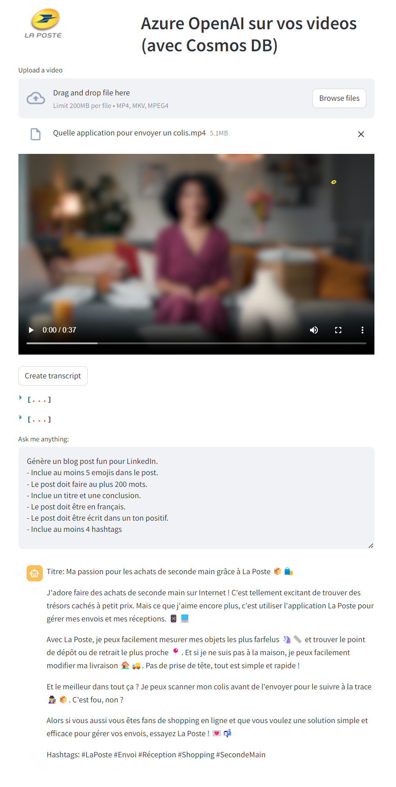

# MSFT-demos
Demos for Microsoft products and technologies

- 2023-10-17: Generate Gremlin code with Azure Cosmos DB for Apache Gremlin and Azure OpenAI [link to folder](generate-gremlin-code)
- 2023-10-17: Fraud detection using Azure Computer Vision [link to folder](fraud-detection)
- 2023-10-16: Chat on your videos with Azure OpenAI and Azure Cosmos DB for NoSQL: [link to folder](chat-on-video)

| Date            | Description                                                                     | Illustration                                                        |
|-----------------|---------------------------------------------------------------------------------|---------------------------------------------------------------------|
| 2023-10-17      | Generate Gremlin code with Azure Cosmos DB for Apache Gremlin and Azure OpenAI  |   |
| 2023-10-17      | Fraud detection using Azure Computer Vision                                     |   |
| 2023-10-16      | Chat on your videos with Azure OpenAI and Azure Cosmos DB for NoSQL             |   |
