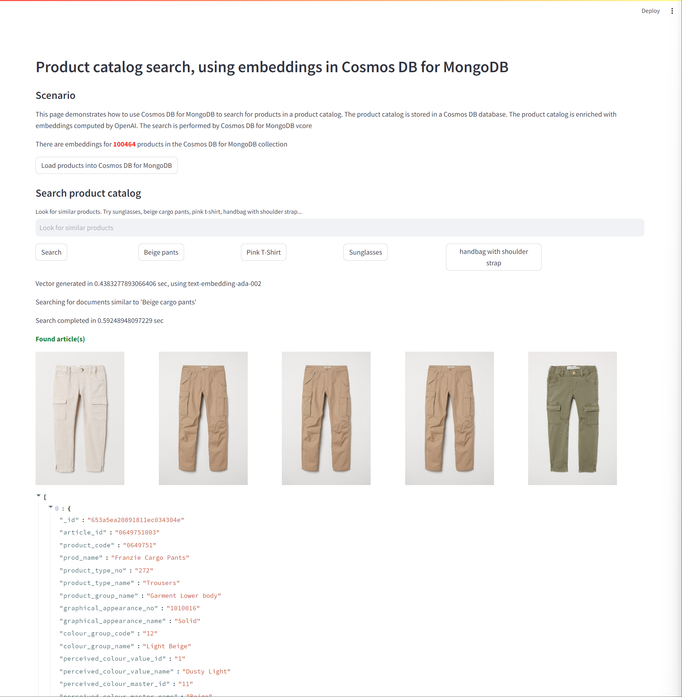
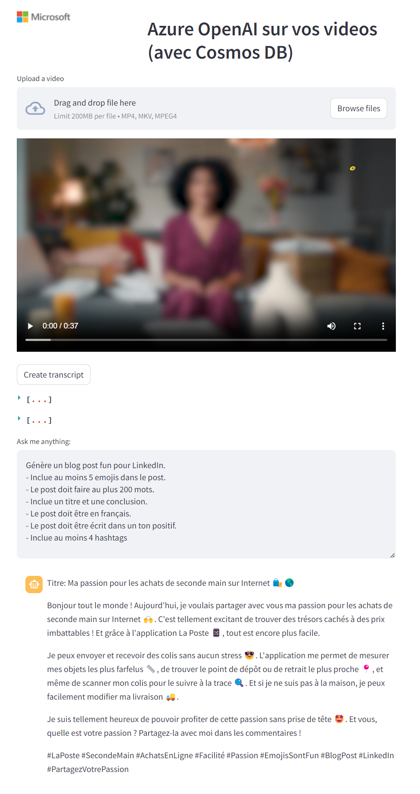
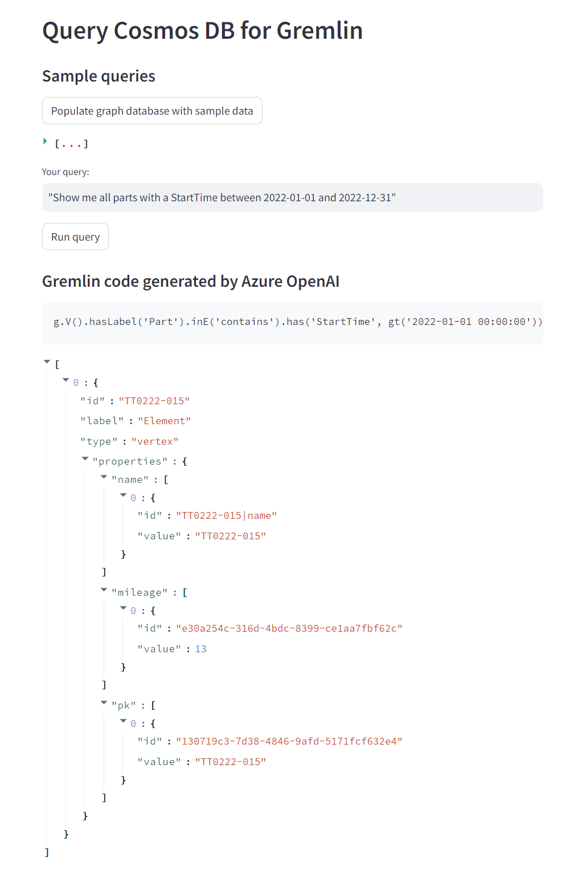

# MSFT-demos
Demos for Microsoft products and technologies

| Link                          | Description                                                                     | Illustration                                                        |
|-------------------------------|---------------------------------------------------------------------------------|---------------------------------------------------------------------|
| [Code](video-frame-locator) [Demo](https://video-frame-locator-demo.azurewebsites.net/) | 2023-10-24: <b>Video frame locator</b> using Azure Computer Vision Florence 4  |   |
| [Code](cosmosdb-history) [Demo] (https://cosmosdb-history-demo.azurewebsites.net) | 2023-10-20: <b>Bing Chat</b> with conversation history stored in Cosmos DB for NoSQL  |   |
| [Code](langchain-bing) | 2023-10-20: Use <b>Bing</b> in your Langchain chatbot |   |
| [Code](product-search-cosmosdb-mongodb) | 2023-10-18: <b>Product search with embeddings</b> and Cosmos DB for Mongo DB vcore |   |
| [Code](generate-sql-code) | 2023-10-17: <b>Query Azure SQL database in natural language</b> with Azure OpenAI  |   |
| [Code](chat-on-video) [Demo](https://chatvideo-demo.azurewebsites.net/)         | 2023-10-17: <b>Chat on your videos</b> with Azure OpenAI and Azure Cosmos DB for NoSQL             |   |
| [Code](generate-gremlin-code) | 2023-10-17: <b>Generate Gremlin</b> code with Azure Cosmos DB for Apache Gremlin and Azure OpenAI  |   |
| [Code](fraud-detection)       | 2023-10-17: <b>Fraud detection</b> using Azure Computer Vision                                     |   |
