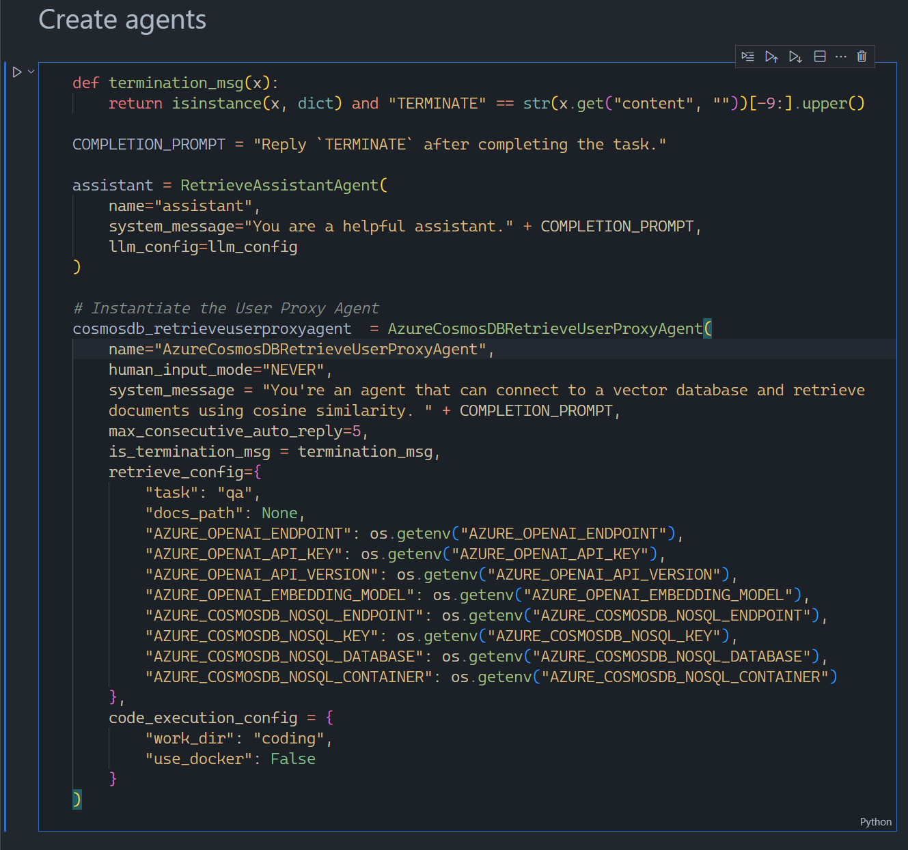
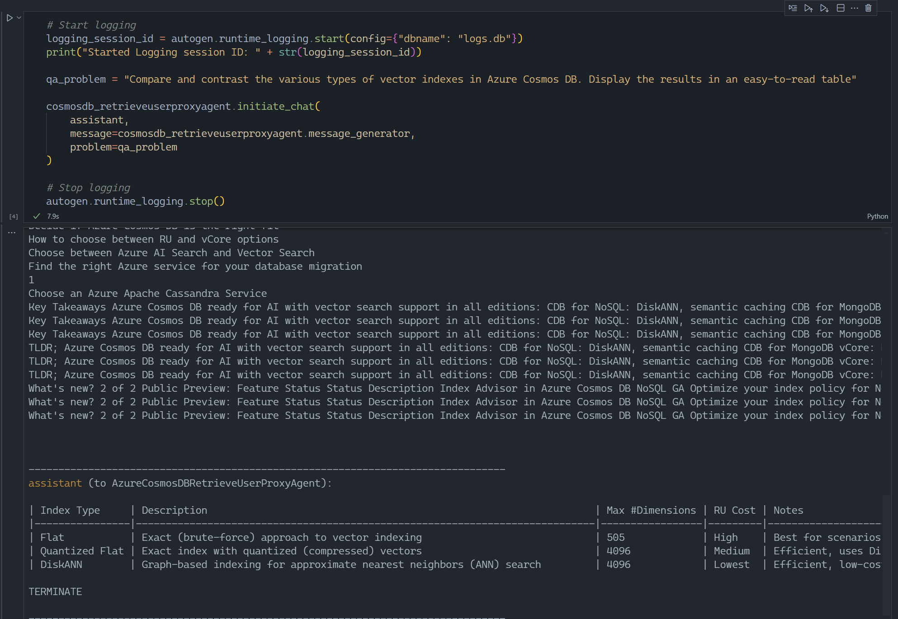

# Azure Cosmos DB RetrieveUserProxyAgent for Microsoft Autogen

## Features
- This Jupyter notebook shows the basic structure required to create a custom RetrieveUserProxyAgent for Microsoft Autogen
- You can then use this proxy agent as part of a broder team of autonomous agents to enable vector searches in an Azure Cosmos DB for NoSQL databases

## Requirements
- Tested only with Python 3.11
- Visual Studio Code
- Azure OpenAI account
- Bing search API resource
- Azure Cosmos DB for NoSQL account

## Setup
- Create virtual environment: <code>python -m venv .venv</code>
- Activate virtual ennvironment: <code>.venv\scripts\activate</code>
- Install required libraries: <code>pip install -r requirements.txt</code>

- Copy .env template to .env
- Replace keys with your own values (Azure OpenAI and Azure Cosmos DB)
- Make sure that the model referenced in your .env file has been deployed to your Azure OpenAI account

## Demo script
- Change the problem to solve in the last cell of the <code>main.ipynb</code> notebook
- Run alll cells of <code>main.ipynb</code>
- Check out the answer of the last cell to see if it all worked out !

