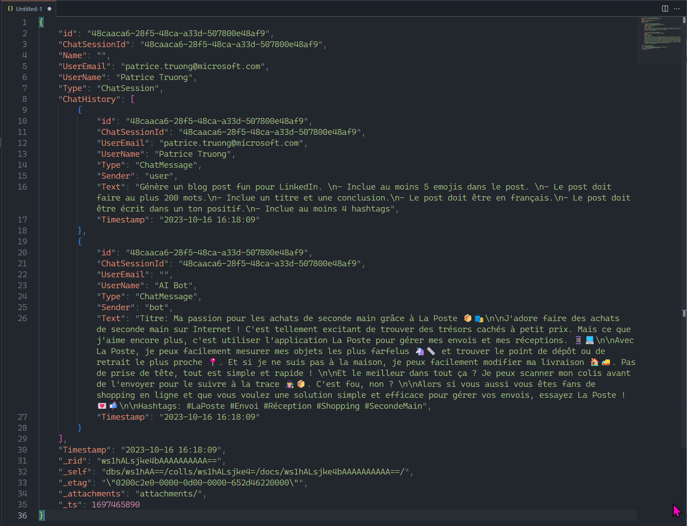

# Chat on a video

## Features
- Video to audio, using moviepy
- Audio to text, using Azure OpenAI Whisper
- Create embeddings using Azure OpenAI text-embedding-ada-002
- In-memory vector store with FAISS
- Save user conversations in Cosmos DB for NoSQL

## Requirements
- Streamlit application
- Tested only with Python 3.10.9. May not work with Python 3.11+ !
- Azure OpenAI account
- Speech recognition account
- Azure Cosmos DB for NoSQL account

## Setup
- Create virtual environment: <code>python -m venv .venv</code>
- Activate virtual ennvironment: <code>.venv\scripts\activate</code>
- Install required libraries: <code>pip install -r requirements.txt</code>
- Copy .env template to .env
- Replace keys with your own values

## Demo script
- Run demo: <code>streamlit run app.py</code>
- Click on "browse files"
- Select "Quelle application pour envoyer un colis.mp4"
- Click "Create transcript". This will extract the audio (using Whisper) and create the transcript of the audio (will open the .txt file, if the transcript has already been created)
- Ask the various questions to illustrate Azure OpenAI functionalities
    - Summarization
    - Prompt engineering with out formatting instructions
    - Translation in various languages
    - Customizing tone of the answer
    - Text generation (with formatting instructions)
- Show conversation history in Cosmos DB

