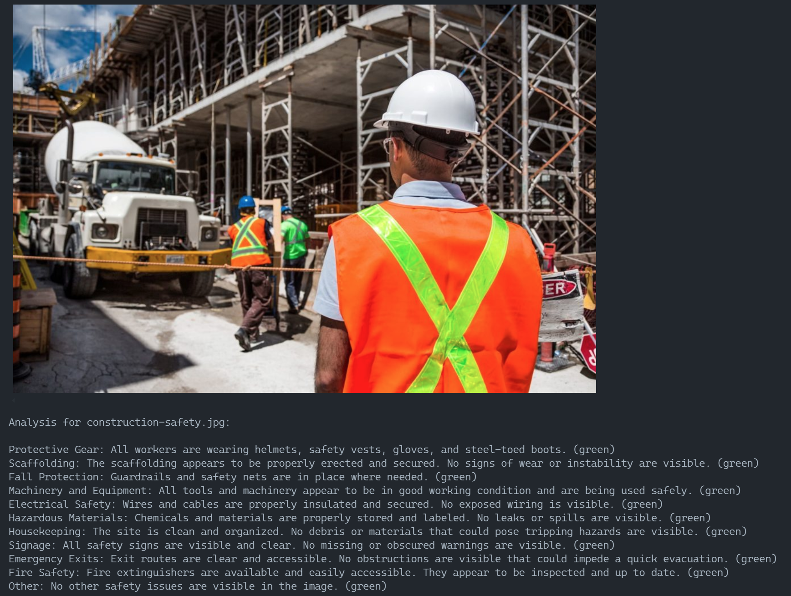

# Jupyter notebooks comparing Computer Vision models

## Features
- Jupyter notebooks using GPT4 Turbo with vision, Phi 3.5 Vision Instruct, Llama 3.2 Vision and GPT-4o mini models
- Construction sites safety analysis

## Requirements
- Azure OpenAI account (for GPT models)
- Azure Computer Vision account (for Phi 3.5 and GPT-4 Turbo with Vision)
- Ollama 0.4.0-rc3 for Llama 3.2 Vision 11b (Ollama 0.3 will not work)

## Setup
- Create virtual environment: <code>python -m venv .venv</code>
- Activate virtual environment: <code>.venv\scripts\activate</code>
- Install required libraries: <code>pip install -r requirements.txt</code>

- Copy .env template to .env
- Replace keys with your own values

