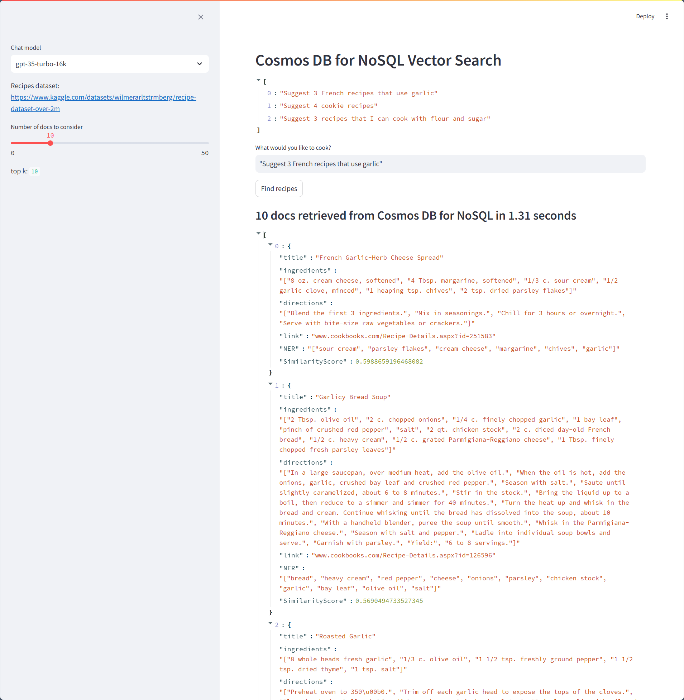

# Vector search with Azure Cosmos DB for NoSQL

## Features
- Vector search using Azure Cosmos DB for NoSQL
- Create embeddings using Azure OpenAI text-embedding-3-small

## Requirements
- Streamlit application
- Tested only with Python 3.11
- Azure OpenAI account
- Azure Cosmos DB for NoSQL account

## Setup
- Create virtual environment: <code>python -m venv .venv</code>
- Activate virtual ennvironment: <code>.venv\scripts\activate</code>
- Install required libraries: <code>pip install -r requirements.txt</code>
- Copy .env.template to .env
- Replace keys with your own values

## Demo script
- Navigate to the import-recipes directory
- Using your favorite browser, head over to https://www.kaggle.com/datasets/wilmerarltstrmberg/recipe-dataset-over-2m and download the dataset recipes.csv
- Open "import_cosmosdb_nosql.ipynb" python notebook
- Run the cells to create the database (with vector support), create the container and populate the Cosmos DB database with recipes data

- Navigate to the front directory
- Run demo: <code>streamlit run app.py</code>
