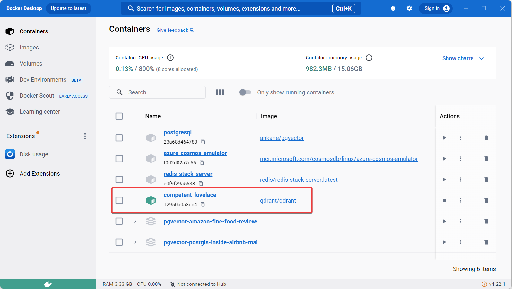
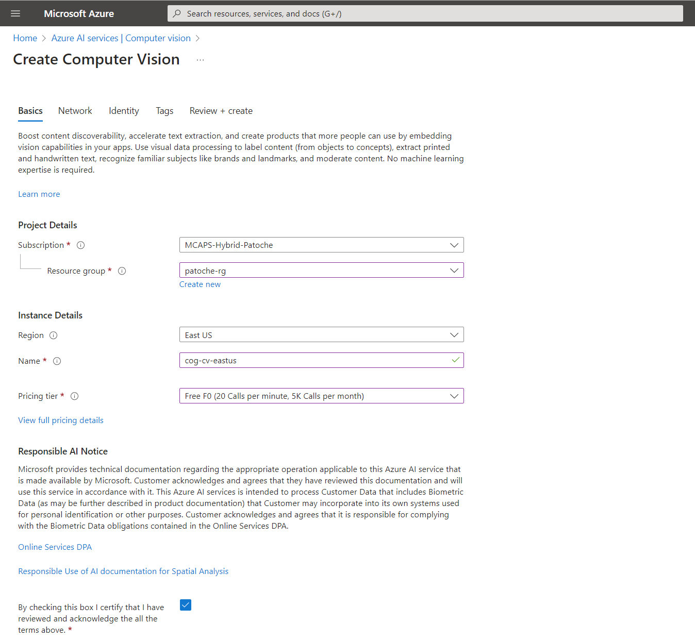
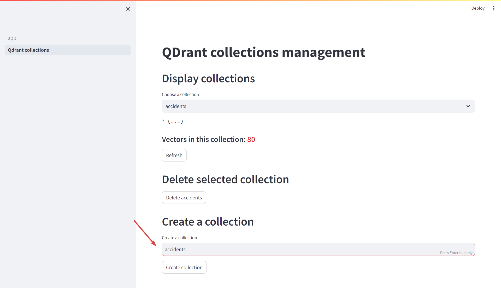

# Fraud detection with Azure Computer Vision and Qdrant

## Features
- This demo shows how embeddings can be created from images (not only text!)
- Vector representations are stored in Qdrant
- Images themselves are stored in an Azure blob storage
- The demo uses Azure Computer Vision to recognize forms in an image
- It then computes embeddings for that image and does a cosine similarity search in the vector database to determine if the image has already been used in an accident claim

## Requirements
- Streamlit application
- Tested only with Python 3.10.9. May not work with Python 3.11+ !
- Qdrant vector database (vector store)
- Azure Cognitive Services Computer Vision account (image recognition)
- Azure Blob Storage account to store the images (persistent storage for reference images)

## Setup
- Create virtual environment: <code>python -m venv .venv</code>
- Activate virtual ennvironment: <code>.venv\scripts\activate</code>
- Install required libraries: <code>pip install -r requirements.txt</code>

- Follow the quickstart here: https://qdrant.tech/documentation/quick-start/ to install Qdrant in a Docker container (use localhost:6333 in the .env file)

- Create an Azure Computer Vision account

- Create an Azure storage account that will store the reference images
- Create a "data" container in the storage account

- Copy .env template to .env
- Replace keys and urls with your own values

## Demo script
- Run demo: <code>streamlit run app.py</code>
- Using the "Qdrant collections" page, create a new collection called "accidents"

- (if necessary) Click on "Browse" to load reference images from the data/training_data folder
- Click on the "Convert images to embeddings" to compute embeddings and store the assicated vectors in Qdrant

- You can them upload a new image and check if it has been used already or not (easiest is to pick an image from the training data set, it should find it in the database)

