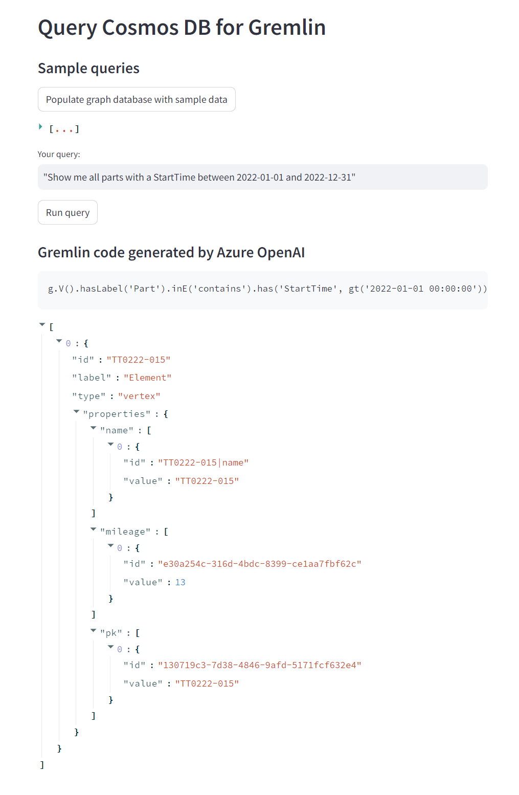
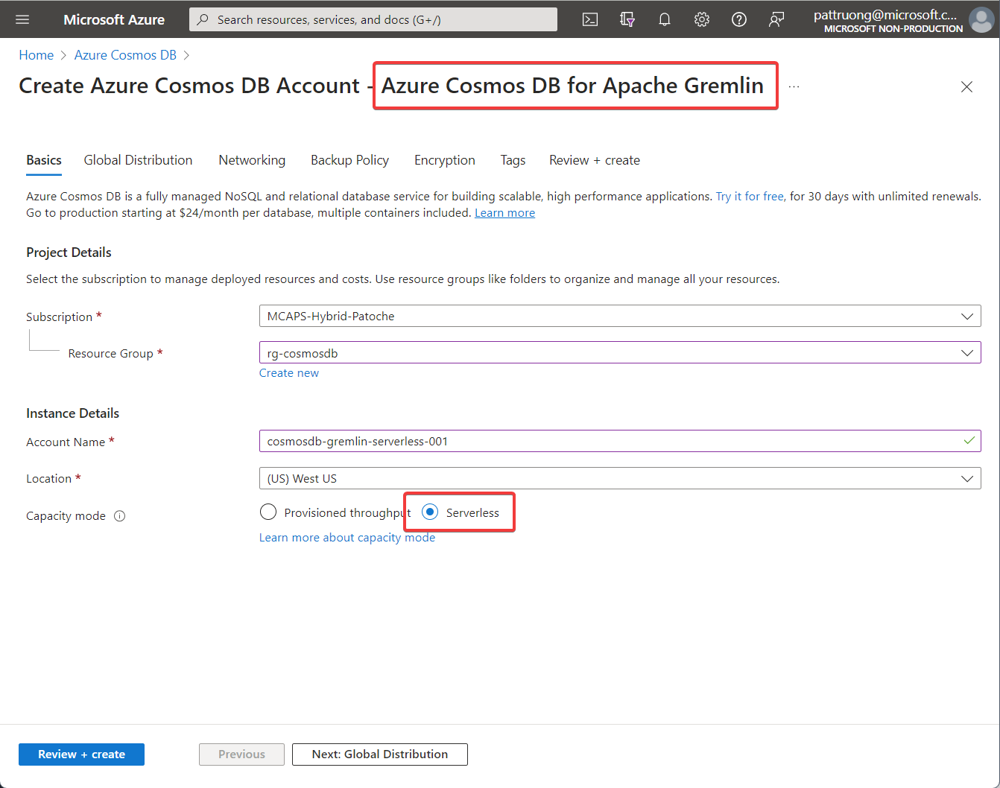

# Generate Gremlin code using Azure OpenAI

## Features
This demo shows how we can generate Gremlin code (in addition to SQL, Python...) using Azure OpenAI "GPT 3.5 turbo instruct". It uses a Cosmos DB for Apache Gremlin database to store the demo graph (parts mounted in a motor)

## Requirements
- Streamlit application
- Tested only with Python 3.10.9. May not work with Python 3.11+ !
- Azure OpenAI account
- Azure Cosmos DB for Gremlin account

## Setup
- Create virtual environment: <code>python -m venv .venv</code>
- Activate virtual ennvironment: <code>.venv\scripts\activate</code>
- Install required libraries: <code>pip install -r requirements.txt</code>

- Create a Cosmos DB for Apache Gremlin account (serverless recommended)
- Create a Graph database called "DemoDb"
- In this database, create a graph called "DemoGraph"

- Copy .env template to .env
- Replace keys with your own values

## Demo script
- Run demo: <code>streamlit run app.py</code>
- (if necessary) populate the graph database
- pick a natural language query and click on the Query button to generate the Gremlin code

 
