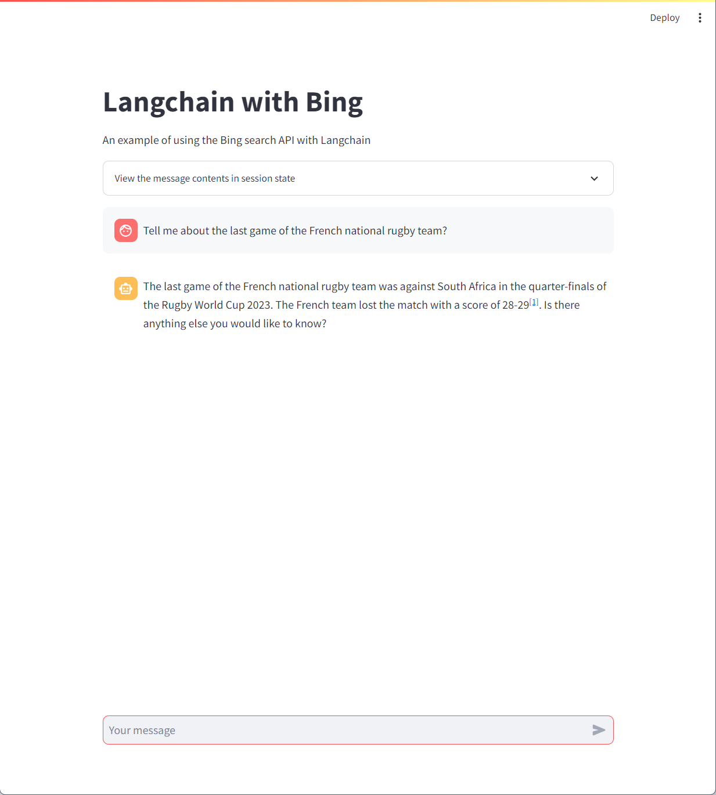

# Langchain with Bing

## Features
This demo shows how to connect the Bing search API to Langchain tools to get up to date answers

## Requirements
- Streamlit application
- Tested only with Python 3.10.9. May not work with Python 3.11+ !
- Azure OpenAI account
- Bing search API resource

## Setup
- Create virtual environment: <code>python -m venv .venv</code>
- Activate virtual ennvironment: <code>.venv\scripts\activate</code>
- Install required libraries: <code>pip install -r requirements.txt</code>

- Create a Bing resource in the Azure portal

- Copy .env template to .env
- Replace keys with your own values
- Make sure that the model referenced in your .env file has been deployed to your Azure OpenAI account

## Demo script
- Run demo: <code>streamlit run app.py</code>
