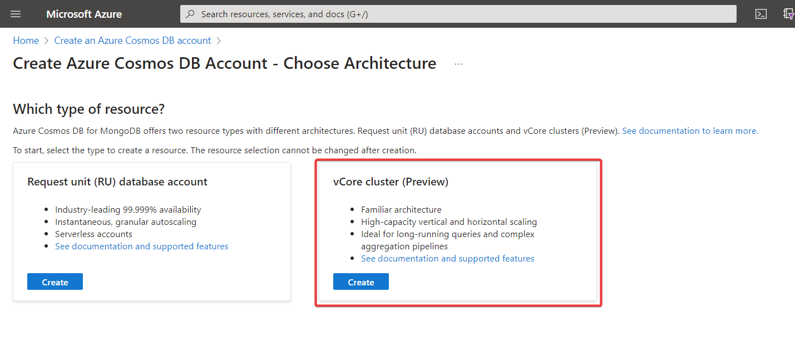
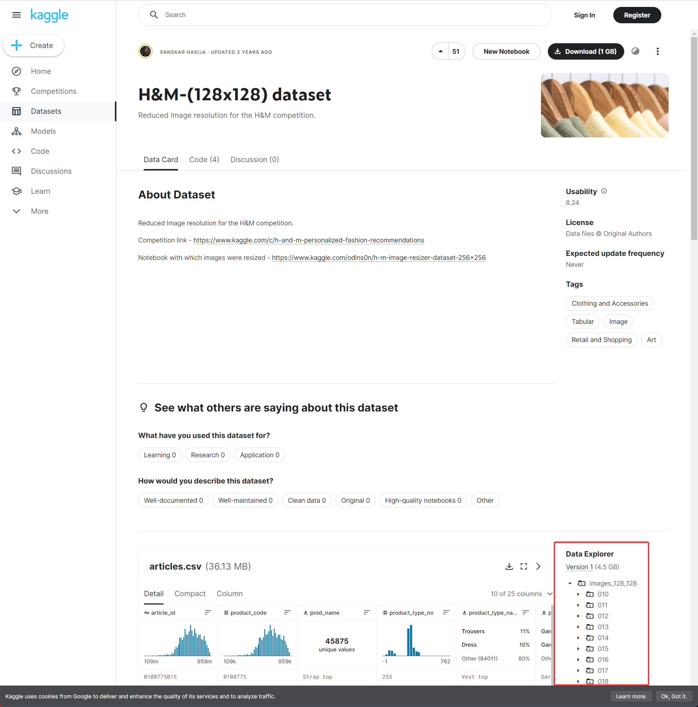
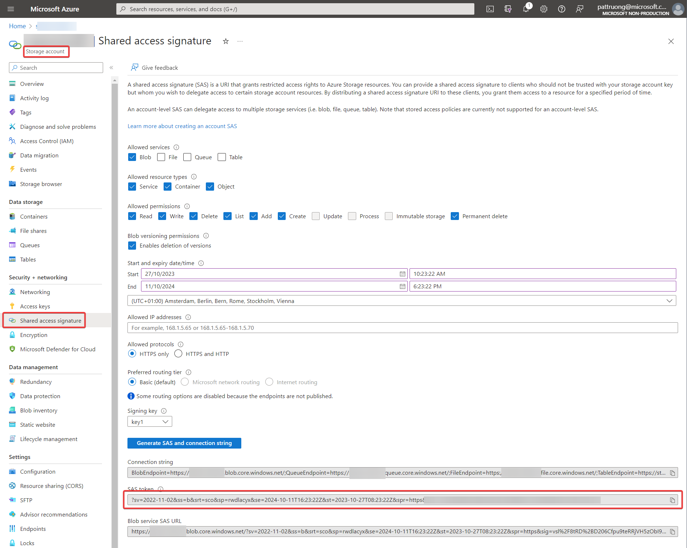

# Product catalog search, using embeddings in Cosmos DB for MongoDB

## Features
This demo allows a user to query a product database using embeddings. Multiple language models are used to show how the training data set and the length of the vectors can impact result accuracy.

Product images are stored in an Azure storage account. 
Product embeddings are stored in Cosmos DB for MongoDB
Embeddings are computed using Azure OpenAI text-embedding-ada-002

## Requirements
- Streamlit application
- Tested only with Python 3.10.9. May not work with Python 3.11+ !
- Azure OpenAI account
- Azure Cosmos DB for MongoDB vCore account (not RU)
- Azure storage account

## Setup
- Create virtual environment: <code>python -m venv .venv</code>
- Activate virtual ennvironment: <code>.venv\scripts\activate</code>
- Install required libraries: <code>pip install -r requirements.txt</code>

- Create an Azure Cosmos DB for MongoDB vCore account (not RU)

- Create an Azure storage account
- In that storage account, create a container called "data"
- In this container, create a folder called "assets"
- Grab the product dataset from Kaggle: https://www.kaggle.com/datasets/odins0n/handm-dataset-128x128 and copy the images folder to {storage_account}/data/assets

- Copy .env template to .env
- Create a Shared Access Signature for your storage account and copy the value to BLOB_TOKEN in your .env file

- Replace keys with your own values
- Double check that you have deployed a model called "text-embedding-ada-002" in your Azure OpenAI account

## Demo script
- Run demo: <code>streamlit run Using_Azure_OpenAI.py</code>
- If this is a brand new installation, click on the "Load products" to load 100K products (with embeddings) in the Cosmos DB for Mongo database

- Pick one of the sample product queries (or type your own and click on Search) 
- This will vectorize your query and compare with embeddings stored in your Cosmos DB for MongoDB database
