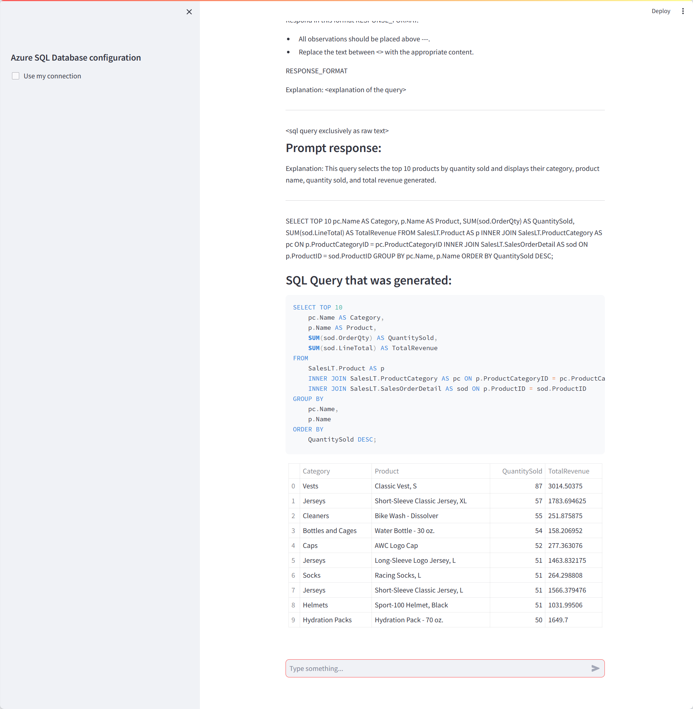

# Query any Azure SQL Database in natural language

## Features
This demo shows how you can query an Azure SQL database in natural language using Azure OpenAI GPT 3.5 Turbo.

## Requirements
- Streamlit application
- Tested only with Python 3.10.9. May not work with Python 3.11+ !
- Azure OpenAI account
- Azure SQL database

## Setup
- Create virtual environment: <code>python -m venv .venv</code>
- Activate virtual ennvironment: <code>.venv\scripts\activate</code>
- Install required libraries: <code>pip install -r requirements.txt</code>

- If necessary, create a new Azure SQL Server and an Azure SQL database
- Populate the database using AdventureWorks scripts: https://learn.microsoft.com/en-us/sql/samples/adventureworks-install-configure?view=sql-server-ver16&tabs=ssms#creation-scripts

- Copy .env template to .env
- Replace keys with your own values

## Demo script
- Run demo: <code>streamlit run app.py</code>
- Pick one of the sample queries (or type your own) 
- You can also use your own Azure SQL by entering the correct connection information in the sidebar

