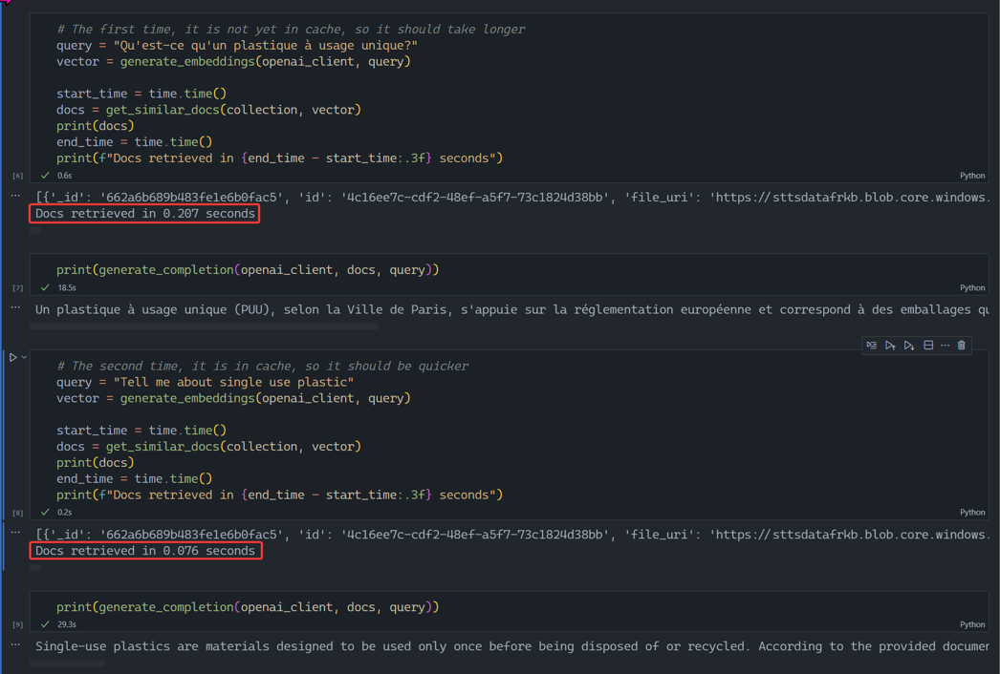

# Semantic Caching with Azure Cosmos DB for MongoDB vCore

## Features
- This notebook shows how to use Semantic caching with Azure Cosmos DB for MongoDB vCore

## Requirements
- Streamlit application
- Tested only with Python 3.11
- Azure Cosmos DB for MongoDB vCore
- Data vectorized and stored in Azure Cosmos DB for MongoDB vCore

## Setup
- Create virtual environment: <code>python -m venv .venv</code>
- Activate virtual ennvironment: <code>.venv\scripts\activate</code>
- Install required libraries: <code>pip install -r requirements.txt</code>
- Copy .env.template to .env
- Replace keys with your own values

## Demo script
- Open "semantic_cache.ipynb" python notebook
- Run the cells to query your collection in Azure Cosmos DB for MongoDB vCore

- if you ingest the sample "paris_journal.pdf" file, you can ask these questions (some of which are semantically identical):

"Qu'est-ce que le plastique à usage unique?"
"Tell me about single use plastic"
"Quelles sont les mesures qui ont été prises en faveur de l'habitat à Paris?"
"What has been done in Paris, with regards to housing?"
